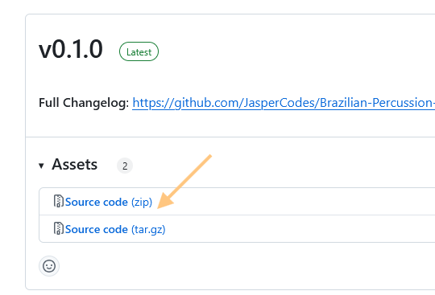
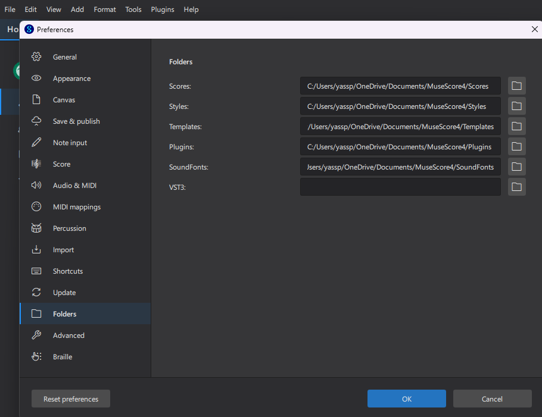
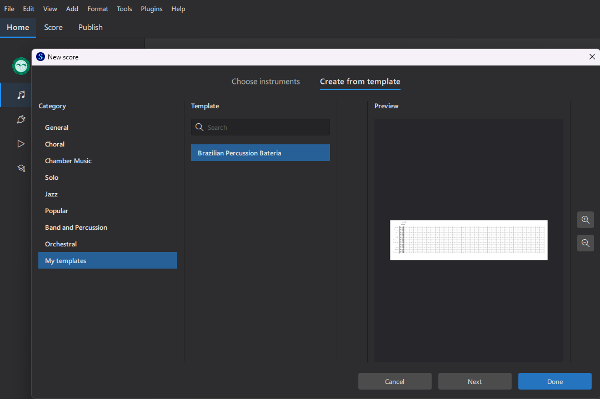
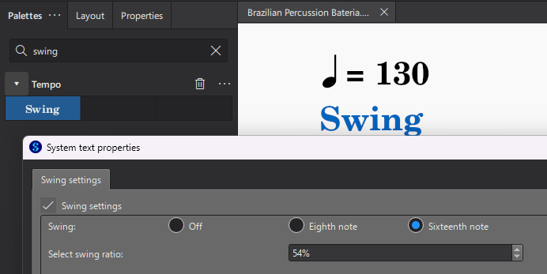

# Brazilian Percussion Bateria MuseScore template

This repository contains a fully useable template for creating, listening and sharing Brazilian percussion arrangement for a variety of styles (Rio, Bahia) in [MuseScore 4](https://musescore.org/en). 

- Fully useable template, start creating arrangements immediately after installing
- Most common samba instruments readily available with full audio support; listen to your arrangement as you create it!

Most instruments use a custom SoundFont, which I've carefully composed for this project using various sample sources. Some instruments use the default sounds available in MuseScore4.

> This template requires MuseScore version 4.5 or higher

## How to use

1. Go to [releases](https://github.com/JasperCodes/Brazilian-Percussion-Bateria-MuseScore-template/releases) and download the ` Source code (zip)` or `Source code (tar.gz)` file of the latest version:
    
    

1. Copy the contents of the folders `Soundfonts`, `Styles` en `Templates` to your corresponding local MuseScore folders. These folders can be usually be found in your user Documents folder, e.g. `/Documents/MuseScore4` or `/Documents/MuseScore/MuseScore4`
    > If you cannot find your local MuseScore user folder, open MuseScore's preferences menu via `Edit` --> `Preferences` and navigate to the `Folders` tab:
        

1. In the dialog menu when creating a new score in MuseScore, choose the tab `Create from Template`, select category `My templates` and select the `Brazilian Percussion Bateria` template.

    

1. Remove any instruments you don't need
1. Start arranging!

## Tips

- For a rough approximation of samba swing, add a `Swing` palette with 16th note swing, around 54% works best for me, your mileage may vary:
    
    
- You can [publish your arrangement to the MuseScore cloud](https://handbook.musescore.org/file-management/publish-to-musescorecom) and share it with your band members, they can even listen to the arrangement if you export it with audio!

## To-do

- Add bloco style repinique instrument (with plastic sticks)